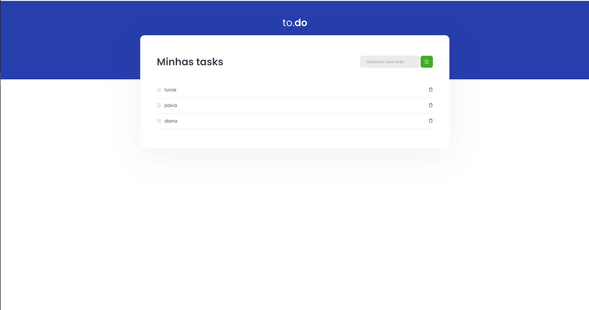

<p align="center">
   
</p>

<p align="center">	
   <a href="https://www.linkedin.com/in/lucas-antonio-paiva/">
      
   </a>
  

</p>

> :rocket: Nesse desafio, você deverá criar uma aplicação para treinar o que aprendeu até agora no ReactJS @Rocketseat

<p align="center">
    <a href="README-pt.md">Português</a>
 </p>

<div align="center">
  <sub>The Ignite-Desafio-01-Conceitos-do-React ❤︎ by
    <a href="https://github.com/lcspaiva87">Lucas Antonio</a> and
   
  </sub>
</div>


### Web Screenshot

<div style="display: flex; flex-direction: 'row'; align-items: 'center';">
   
   
</div>


# :eyes: Site de Demostração
Você pode acessar o site em:     
👉  demo: 

[     

# :computer: Tecnologias
Esse projeto foi feito utilizando as seguintes tecnologias:

* [Typescript](https://www.typescriptlang.org/)      
* [React](https://reactjs.org/)      
* [webpack](https://webpack.js.org//)       
* [sass](https://sass-lang.com/) 

# :rocket: Funcionalidades

* Nesse desafio, você deverá criar uma aplicação para treinar o que aprendeu até agora no ReactJS


# :construction_worker: Como rodar
```bash
# Clone o Repositoria
$ git clone 
```


### 💻 Rode o Project Web

```bash
# Vá para a pasta web
$ cd to.do/web

# Instale as depedencias
$ yarn install

# Rode a aplicação
$ yarn start
```
Acesse: http://localhost:3000/ para ver o resultado.


# :bug: Problemas

Fique a vontade **para criar uma nova issue** com o respectivo titulo e descrição na página de issues do [to.do](https://github.com/lcspaiva87) Repositorio. Se você já encontrou a solução para o problema, **Eu amaria fazer o review do seu pull request**!

# :tada: Contribuindo

Confira a página de [contribuição](./CONTRIBUTING.md) para ver como começar uma discução e começar a contribuir.

# :closed_book: Licencia

Lançado em 2020 :closed_book: Licencia

Made with love by [lucas Antonio](https://github.com/lcspaiva87) 🚀.
Esse projeto esta sobre [MIT license](./LICENSE).


Dê uma ⭐️ se esse projeto te ajudou!
